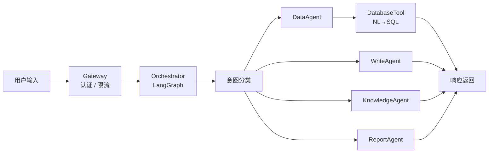

<div align="center">

# Agent-Zs

**企业级 ERP 自然语言智能操作层**

用自然语言替代复杂 ERP 操作 — 查询数据、创建单据、知识检索、报表生成


</div>

---

## 目录

- [功能特性](#功能特性)
- [快速开始](#快速开始)
- [API 文档](#api-文档)
- [项目结构](#项目结构)
- [技术栈](#技术栈)
- [本地开发](#本地开发)
- [部署](#部署)
- [架构设计](#架构设计)

---

## 功能特性

| 功能 | 说明 | 示例 |
|------|------|------|
| 自然语言查询 | NL→SQL，智能查询业务数据 | "查询北京仓库存不足的商品" |
| 创建单据 | 支持采购/销售/出入库/报销单 | "创建采购订单，供应商华为，金额50000" |
| 知识检索 | 语义搜索企业知识库 | "采购订单审批流程是什么" |
| 报表生成 | 智能数据可视化 | "统计本月各部门销售额" |
| 行级权限 | 基于用户角色的数据隔离 | 仓管只能看自己仓库的数据 |
| 配置中心 | Web 后台管理模型/策略/数据源 | 可视化管理所有配置 |

### 支持的单据类型

| 单据 | 必填字段 |
|------|----------|
| 采购订单 | 供应商名称、仓库名称、订单日期 |
| 销售订单 | 客户名称、仓库名称、订单日期 |
| 报销单 | 报销类型、金额、费用日期 |
| 入库单 | 仓库名称、入库类型 |
| 出库单 | 仓库名称、出库类型 |

---

## 快速开始

### 访问前端

```
http://172.177.3.43:8001/
```

直接在对话框输入问题即可使用。

### API 调用

接口文档详见 [API 文档](#api-文档)，支持数据查询、创建单据、知识检索等能力。

---

## API 文档

### 对话接口

| 端点 | 方法 | 说明 | 认证 |
|------|------|------|------|
| `/api/v1/query` | POST | 自然语言查询/创建单据 | Bearer Token |
| `/api/v1/query/stream` | GET | SSE 流式查询 | Bearer Token |

### 认证接口

| 端点 | 方法 | 说明 |
|------|------|------|
| `/api/v1/auth/login` | POST | 用户登录 |
| `/api/v1/auth/me` | GET | 获取当前用户信息 |
| `/api/v1/auth/logout` | POST | 退出登录 |

### 管理接口

| 端点 | 方法 | 说明 | 认证 |
|------|------|------|------|
| `/api/v1/admin/config` | GET | 配置管理中心页面 | 管理员 |
| `/api/v1/admin/config/llm` | GET/PUT | LLM 配置管理 | 管理员 |
| `/api/v1/admin/config/model-routes` | GET | 模型路由配置 | 管理员 |
| `/api/v1/admin/config/tools/{name}` | PUT | 工具策略配置 | 管理员 |
| `/api/v1/admin/config/datasources` | GET | 数据源管理 | 管理员 |

### 基础接口

| 端点 | 方法 | 说明 | 认证 |
|------|------|------|------|
| `/` | GET | 前端对话页面 | 否 |
| `/health` | GET | 健康检查 | 否 |
| `/api/v1/workflow/list` | GET | 工作流列表 | 否 |

---

## 项目结构

```
agent-zs/
├── app/
│   ├── main.py                # FastAPI 应用入口
│   ├── config.py              # 配置管理 (pydantic-settings)
│   ├── adapter/               # ERP 适配层 (幂等性、订单映射)
│   ├── agent/                 # LLM 客户端、提示词模板
│   ├── agents/                # Agent 层
│   │   ├── data_agent.py      #   数据查询 Agent
│   │   ├── write_agent.py     #   单据创建 Agent
│   │   ├── knowledge_agent.py #   知识检索 Agent
│   │   └── report_agent.py    #   报表生成 Agent
│   ├── config_center/         # 配置中心 (DB 持久化 + 缓存)
│   ├── db/                    # 数据库会话、表结构自省
│   ├── gateway/               # 认证、限流、模型网关
│   ├── memory/                # 会话记忆 (Redis)、用户偏好 (MySQL)
│   ├── models/                # Pydantic 数据模型
│   ├── orchestrator/          # LangGraph 编排层
│   ├── routers/               # FastAPI 路由
│   ├── runtime/               # 运行时引擎、状态机
│   ├── security/              # 安全模块 (加密、审计、脱敏)
│   ├── services/              # 业务服务 (会话持久化)
│   ├── tools/                 # 工具层 (数据库、搜索、审批等)
│   ├── worker/                # 后台任务 Worker
│   └── workflow/              # 工作流引擎
├── scripts/                   # SQL 初始化脚本
├── tests/                     # 测试用例
├── docs/                      # 设计文档
├── Dockerfile
├── docker-compose.yml
└── requirements.txt
```

---

## 技术栈

| 层次 | 技术 | 说明 |
|------|------|------|
| **后端框架** | FastAPI 0.115 | 异步 Web 框架 |
| **编排引擎** | LangGraph | 状态图编排，多 Agent 协作 |
| **数据库** | MySQL 8.0 | ERP 业务数据 (178 张表) |
| **ORM** | SQLAlchemy 2.0 (async) | 异步数据库操作 |
| **缓存** | Redis 7 | 会话记忆、密钥持久化 |
| **向量数据库** | Milvus | 知识库语义检索 |
| **LLM** | DeepSeek | 自然语言理解与生成 |
| **认证** | JWT (HMAC-SHA256) | 无状态认证，行级权限 |
| **加密** | bcrypt + Fernet | 密码哈希 + 配置加密 |
| **部署** | Docker + Docker Compose | 容器化部署 |

---

## 本地开发

### 环境要求

- Python 3.12+
- MySQL 8.0
- Redis 7
- Milvus

### 安装步骤

```bash
# 克隆仓库
git clone git@github.com:Caleb-Mitchell-hub/agent-zs.git
cd agent-zs

# 安装依赖
pip install -r requirements.txt

# 配置环境变量
cp .env.example .env
# 编辑 .env 填入数据库、Redis、LLM 密钥等配置

# 初始化数据库
mysql -u root -p < scripts/init_full_schema.sql
mysql -u root -p < scripts/init_config_center.sql

# 启动服务
uvicorn app.main:app --host 0.0.0.0 --port 8000 --reload
```

### 运行测试

```bash
pytest tests/ -v
```

---

## 部署

```bash
# 使用 Docker Compose 部署
docker compose up -d --build

# 或使用部署脚本
chmod +x deploy.sh && ./deploy.sh
```

部署目标服务器配置详见 [ENVIRONMENT.md](ENVIRONMENT.md)。

---

## 架构设计



- **确定性优先**：列名校验、SQL 沙箱、权限注入均在代码层完成，LLM 仅负责语义理解
- **行级权限隔离**：基于用户角色自动注入数据过滤条件
- **配置热更新**：模型、策略、数据源配置实时生效，无需重启

详细设计文档见 [docs/](docs/)。

---

## 相关文档

- [设计方案](docs/企业级Agent系统设计方案from%20claude%20code.md)
- [环境配置](ENVIRONMENT.md)
- [CLAUDE.md](CLAUDE.md) — 开发规范

---

<div align="center">
<sub>Agent-Zs Team</sub>
</div>
