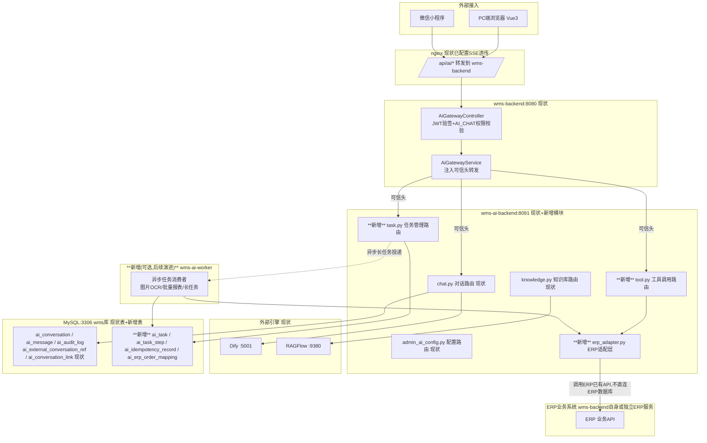

# 企业级智能 Agent 系统设计方案

## 一、项目背景与目标

### 1.1 业务背景
企业希望构建一个统一的智能 Agent 平台,作为员工与企业系统之间的自然语言交互入口,覆盖信息查询、业务操作、报表生成、单据创建等高频场景,替代原本分散在多个系统中的手工操作,降低使用门槛、提升效率。

### 1.2 核心目标
- **对话即操作**:用户用自然语言即可完成查询、下单、建单、出报表等操作
- **多模态输入**:支持文本、图片(如发票、行程单)作为输入
- **系统级对接**:与 ERP、数据库、第三方 API(天气、机票等)打通
- **知识增强**:基于企业内部文档实现 RAG 问答
- **可记忆、可追踪**:具备短期/长期记忆能力,支持任务与工程管理
- **工程级可用**:具备生产环境所需的安全、权限、可观测性、可扩展性

### 1.3 非目标(本期不做)
- 不做端到端的无监督自动决策(涉及资金/审批类操作需要人工确认环节)
- 不替代 ERP 本身的复杂业务逻辑,Agent 只做"编排+调用",不重复实现业务规则

### 1.4 现状系统概览与能力差距(根据已有代码/接口文档更新)

根据已提供的《PC端AI助手模块设计方案与接口文档》《小程序端AI模块设计方案与接口文档》,当前系统**并非从零开始**,而是已有一套可用的基础链路。这一发现对第四、五、七章的具体方案有实质性修正,先在此说明现状,后续章节中标注"已有/需新增"。

**现状架构**(与本方案第四章"独立微服务"的建议高度吻合,已是正确路径,不需要推翻重来):

```
浏览器/小程序 → Java 网关(wms-backend:8080,JWT鉴权+权限校验+可信头转发)
             → Python AI Backend(wms-ai-backend:8091,FastAPI)
             → Dify(工作流/对话引擎) + RAGFlow(知识库检索引擎)
             → MySQL(wms库,5张 ai_* 表)
```

**已具备的能力**:

| 能力 | 现状 |
|---|---|
| 对话与 SSE 流式响应 | 已实现,PC端走 `/api/ai/chat/workflow/stream`,小程序端走 `wx.request(enableChunked:true)` + 自研 SSE 分片解析器,本方案早前讨论的"小程序流式方案该怎么选"已经有确定答案,不需要再论证 |
| 会话与消息持久化 | 已实现,`ai_conversation` / `ai_message` 两张表,本地 MySQL 为权威数据源,Dify 侧仅作为计算引擎,并已有 `ai_external_conversation_ref` 做外部会话映射 |
| 保留期与生命周期管理 | 已实现,MINI 90天 / PC 365天自动归档,定时任务(APScheduler)每日执行,收藏/置顶可永久保留 |
| 审计日志 | 已实现,`ai_audit_log` 表,append-only,记录 SEND_MESSAGE / CONVERSATION_DELETE 等操作 |
| 跨端会话同步 | 已实现,`ai_conversation_link` 表支持会话在 PC/小程序间的同步与迁移,比本方案原设计更完整 |
| 鉴权 | 已实现,"Java 网关做 JWT 验签+权限校验,Python 层信任可信头"的模式,比本方案原先泛泛而谈的"SSO/RBAC"更具体,后续按此模式扩展即可 |
| RAG 检索 | 已实现,基于 **RAGFlow**(数据集/文档/检索 API 均已封装),不需要按本方案 7.6 节从零设计切分/向量化流程 |
| 多端配置管理 | 已实现,PC 管理页可对 MINI/PC 两端独立配置 Dify Provider、API Key(Fernet加密)、超时等 |
| 部署 | 已实现,Docker 容器化,Java/Python/MySQL 挂在 `project-10_wms-network`,Python 侧额外双网卡接入 `docker_default` 访问 Dify/RAGFlow,nginx 已针对 SSE 做好 `proxy_buffering off` 等配置 |

**尚未具备、需要新增的能力**(即本方案真正的增量工作范围):

| 能力 | 现状 | 对应本方案章节 |
|---|---|---|
| 工具调用 / Agent 执行引擎 | 前端已有 `AgentPlaceholder.vue`(能力卡片:数据分析/智能问答/文档检索/流程编排;工具列表:数据库查询/API调用/代码执行/文档解析),但**明确是占位组件,后端未实现任何工具调用逻辑** | 5.1、5.2 |
| ERP 写操作(建单等) | 未实现,当前链路只有对话和知识库检索,没有任何调用 ERP 业务接口的能力 | 4.3、5.6 |
| 幂等与断点恢复机制 | 未实现,当前 SSE 中断后只能重新发起对话,没有任务级 checkpoint / 幂等键设计 | 5.9、7.2、7.3、7.4 |
| 长期记忆/用户画像 | 未实现,现有"记忆"仅是会话历史消息(`ai_message`),没有跨会话的偏好沉淀 | 5.3、7.5 |
| 图片建单(多模态) | 未实现,`api.ts` 目前只有通用文件上传(`AI_ASSISTANT` 业务类型),没有 OCR/视觉抽取和结构化落库逻辑 | 5.5、9.1 |
| 报表生成("一句话出报表") | 未实现 | 5.7 |
| 任务中心 | 未实现,当前是纯对话式交互,没有独立的"任务列表/进度"承接界面 | 5.8、3.4 |
| 多模型路由 | 现状是"每个客户端类型(MINI/PC)绑定一个 Dify App 配置",不是真正的多模型/多厂商路由网关;是否需要升级为本方案 5.10 节的路由网关,取决于是否要跨 Dify 之外接入其他模型 | 5.10、7.7 |
| 细粒度权限 | 现状权限点只有一个 `AI_CHAT`,写操作类工具调用需要更细粒度的权限码(如 `AI_ERP_EXPENSE_WRITE`) | 8 |

**结论**:第四章"做独立微服务"的判断依然成立且已经是既成事实——`wms-ai-backend` 本身就是那个独立服务。**接下来的工作不是新建一套 Agent 平台,而是在 `wms-ai-backend` 现有代码结构(routers/services/models 的分层)基础上,新增工具调用、任务引擎、ERP 适配、幂等机制这几类模块**,复用已有的 `AuthContext`、`ai_chat_store` 等基础设施。第四、五、七章后续内容按此结论做了相应调整。

---

## 二、总体架构设计

采用经典的分层架构,自上而下分为 5 层:

```
┌─────────────────────────────────────────────────────────┐
│  接入层 Interaction Layer                                  │
│  Web端 / 移动端 / 企业IM(飞书/企微/钉钉) / 语音入口            │
└─────────────────────────────────────────────────────────┘
                          │
┌─────────────────────────────────────────────────────────┐
│  Agent 编排层 Orchestration Layer                          │
│  意图理解 → 任务规划(Planner) → 工具调度(Router) → 结果整合    │
│  多Agent协作(Coordinator)  │  记忆管理(Memory Manager)       │
└─────────────────────────────────────────────────────────┘
                          │
┌─────────────────────────────────────────────────────────┐
│  能力层 Capability Layer (Tools / Skills)                  │
│  数据库查询 │ 联网搜索 │ ERP操作 │ RAG检索 │ 多模态解析        │
│  报表生成 │ 任务/工程管理 │ 通知提醒 │ ...(可插拔)             │
└─────────────────────────────────────────────────────────┘
                          │
┌─────────────────────────────────────────────────────────┐
│  数据与集成层 Data & Integration Layer                      │
│  ERP/OA 系统API网关 │ 业务数据库(只读副本) │ 向量数据库          │
│  对象存储(图片/文件) │ 知识库 │ 第三方API(天气/机票/地图)       │
└─────────────────────────────────────────────────────────┘
                          │
┌─────────────────────────────────────────────────────────┐
│  基础设施层 Infrastructure Layer                            │
│  权限与审计 │ 日志与监控 │ 模型网关(多模型路由/限流/降级)        │
│  容器化部署 │ 消息队列 │ 密钥管理                             │
└─────────────────────────────────────────────────────────┘
```

### 2.1 设计原则
1. **工具可插拔**:所有能力以"工具(Tool)"形式注册,新增能力不改动核心编排逻辑
2. **读写分离**:查询类操作走只读通道;写操作(建单、审批)必须经过权限校验+人工确认
3. **模型与业务解耦**:通过模型网关屏蔽底层大模型差异,支持切换/降级/多模型路由
4. **状态可追踪**:每一次任务执行都有完整的 trace,便于审计和问题定位
5. **失败可降级**:工具调用失败时有兜底策略(重试、转人工、返回部分结果)

---

## 三、多端接入与规模化部署设计

结合你补充的背景(3000+ 用户、PC端+小程序端双入口、小程序端以"AI智能助手"嵌入形式为主),这部分对前面的通用架构有几处**实质性影响**,需要单独展开,不是简单的"UI适配"问题。

### 3.1 小程序端的技术约束及应对(重点)

小程序作为主要入口,有几条平台限制会直接决定 5.9 节"任务中断恢复机制"的实现方式,必须提前设计,而不是上线后再补:

| 小程序限制 | 影响 | 应对设计 |
|---|---|---|
| 页面/应用切后台后,网络连接会被系统挂起或断开(WebSocket 不保证后台存活) | 用户切出小程序查看别的应用、或小程序被系统回收,正在进行的"长对话"或"长任务"极易中断 | **任务执行必须与小程序前台生命周期完全解耦**:小程序端只负责"发起任务+轮询/订阅结果",真正执行在服务端异步进行,和 5.9 节的断点恢复机制天然契合,这里更要严格落实,不能假设小程序端会一直在线 |
| 不支持原生 SSE 流式响应 | 常见的"打字机效果"流式输出在小程序里无法用标准 SSE 实现 | **现状已解决**:实际用 `wx.request({enableChunked:true})` + `onChunkReceived` 配合自研 `SseParser`(按 `\n\n` 切分事件、缓冲区处理跨分片粘包)实现了等效的流式效果,不需要再评估长轮询/WebSocket 方案;唯一待补的是断线后的"续接"逻辑(见 5.9 节),现状是断线后只能重新发起对话 |
| 消息推送依赖"订阅消息"(一次性/永久),不能主动无限制推送 | 长任务(如批量报表生成、审批流程较长的ERP单据)完成后如何通知用户 | 任务发起时**引导用户授权一次性订阅消息**,任务完成后通过订阅消息推送提醒,同时任务中心内保留"未读任务"角标,兼顾"用户已关闭小程序"的场景 |
| 图片/文件上传有大小限制,且弱网环境(移动网络)常见 | 发票拍照上传体积较大、网络不稳定 | 客户端先压缩+分片上传,上传接口本身要支持**断点续传**(而不仅仅是任务级别的断点恢复),失败自动重试并有明确进度提示 |
| 小程序需在后台配置"服务器域名白名单"(request/socket合法域名) | 影响多环境(测试/预发/生产)部署和网关拆分方案 | 网关对外统一收敛到少数几个已备案域名,内部再做服务路由,避免为不同能力模块单独暴露域名导致小程序配置频繁变更审核 |
| 微信小程序对 AI 生成内容有强制内容安全审核要求 | 助手的问答结果、生成的报表描述等文本,以及用户上传的图片,理论上都需要过内容安全检测 | 在返回给用户前统一接入**文本安全检测接口**(如涉及)和**图片安全检测**,建议做成网关层的统一前置/后置处理,而不是每个业务模块各自调用,避免遗漏 |
| 小程序包体大小限制,复杂交互组件需要分包加载 | 助手界面如果功能较重(卡片、图表、表单),首次加载体验和包体积需要平衡 | 助手主界面走**分包/按需加载**,复杂的报表可视化组件延迟加载 |

### 3.2 PC端与小程序端的统一架构原则

不建议为两端各写一套业务逻辑,核心原则是**"后端能力统一,前端交互分层适配"**:

- 编排层、工具调用、记忆、RAG、任务引擎等所有核心能力**只有一套服务**,不区分端;区别只在于"接入层"如何调用和展示
- 新增一层**端侧适配层(BFF, Backend for Frontend)**:PC 端 BFF 侧重完整功能(多窗口、复杂报表交互、批量操作);小程序端 BFF 侧重轻量化(单一助手对话流+关键卡片操作),同一个后端任务在两端可以用不同的卡片/表单渲染,但任务状态、记忆、权限完全共享
- **跨端会话延续**:用户在 PC 端发起的任务,应能在小程序端"AI助手"里查到进度并继续操作(反之亦然)。这依赖 7.1 节 `sessions` 表里的 `channel` 字段以及**统一的用户身份**(而不是each端各自的临时身份),身份体系上建议:企业统一身份(SSO/员工工号)作为主键,微信 `openid`/`unionid` 仅作为小程序端登录态的映射,不作为用户主键
- 小程序端的"免登录"体验:通过企业自建小程序 + 后端与企业身份系统(如企业微信/自建SSO)做静默换取 token,避免用户在小程序里感知到"登录"这个动作

### 3.3 3000+ 用户量级的容量规划

3000+ 用户不算超大规模,但如果不提前规划,常见问题会出在"峰值并发"和"LLM调用侧限流"两处,而不是简单的用户总数:

- **并发估算**:按经验取活跃占比,若同时在线/发起请求的峰值并发按总用户数的 5%~10% 粗估(150~300 并发请求),这类企业内部助手通常有明显的**上班时段峰值**(如上午9-10点集中报销、月末集中出报表),建议按峰值 2~3 倍做容量预留,而不是按日均值规划
- **LLM 调用侧是真正的瓶颈**:后端服务本身水平扩展容易,但外部/内部大模型 API 通常有 QPS/TPM(每分钟Token数)限制,需要在模型网关层做**排队+限流**,并配合 5.10 节的多模型路由,在主模型限流时自动分流到备用模型,避免用户端表现为"卡住无响应"
- **数据库与缓存**:3000+ 用户量级建议主库 + 只读副本(用于查询类工具的NL2SQL执行)分离;高频读取(用户画像、常用报表模板、路由配置)加 Redis 缓存,减少对主库的直接压力
- **分租户/分部门限流配额**:防止单个部门(如集中批量报销的月末场景)把资源占满,影响其他部门正常使用,配合 5.11 节已提到的并发限流机制按部门维度细化
- **灰度节奏**:两个入口建议**分别灰度、分别观察**:小程序端用户使用习惯(高频短任务)和PC端(低频复杂任务)负载特征不同,合并灰度容易掩盖某一端的问题

### 3.4 小程序端"AI助手"交互形态的补充设计要点

- 助手在小程序里通常以**独立入口(Tab/浮层入口)+对话流**形式呈现,与ERP原生功能页面共存,建议设计"结构化卡片"作为对话流里的一等公民(如"报销单预览卡片""报表卡片"可直接在对话流里操作确认),而不是单纯文本问答,这样能更好承载 5.5/5.7 节的"确认后提交"交互
- 涉及资金类操作(建单确认)在小程序端建议复用**微信原生的支付/确认交互组件**(如可行),提升用户信任感,而不是完全自定义UI
- 助手需要一个清晰的"任务中心"入口(而非纯对话形式),让用户能主动查看历史任务及其状态,这与 5.9 节"任务可能是异步完成"的设计强相关——对话式交互天然不适合承载"长任务后台运行"的心智,需要有单独的列表页承接


---

## 四、基于现有系统的集成与部署接入方案

结合你的最新背景(ERP 与微信小程序均已开发完成约 88%,ERP 运行在 Ubuntu 的 Docker 服务中),这一节直接给出落地结论和具体接入方式。

> **范围澄清(根据最新反馈更新)**:PC 端已有前端页面和配置页面、小程序端已有前端界面和页面,**两端都不缺 UI,缺的是中间的"连接层"——也就是本方案里说的 Agent 后端服务(编排引擎+工具调用+ERP适配)**。这意味着接下来的工作**不涉及任何前端页面设计**,前面 3.4 节"小程序AI助手交互形态"等内容仅作为理解前端已有交互形式的参考,实际开发交付边界收窄为:**一套后端服务,严格适配现有前端已经定义好的接口调用方式**。这个前提对接入方式有直接影响,展开在下面 4.7 节。

### 4.1 结论先行(根据现状更新):独立服务已经存在,新增能力在其基础上扩展

原方案建议"做独立微服务,不嵌入现有系统"——这个判断依然正确,但**不需要再新建**,因为 `wms-ai-backend`(Python FastAPI,已跑在 `:8091`)本身就是这个独立服务,Java 网关(`wms-backend`)已经在做鉴权转发。这个架构已经是"独立微服务"模式的正确实现,不需要推翻重来。

**因此结论调整为**:工具调用、任务引擎、ERP 适配、幂等机制等新增能力,**优先作为 `wms-ai-backend` 内部的新增 router/service 模块来实现**(复用其已有的 `AuthContext`、`ai_chat_store`、`chat_config_resolver` 等基础设施),而不是另起一个新容器。原因:

| 考虑维度 | 说明 |
|---|---|
| 复用已验证的鉴权链路 | Java 网关→可信头→Python `AuthContext` 这条链路已经跑通,新增的工具调用类接口直接复用同一套 `require_trusted_context`,不需要重新设计一套鉴权 |
| 复用已有数据基座 | `ai_conversation`/`ai_message` 已经承载了会话上下文,新的任务表、幂等表按同样的 `tenant_id`/`client_type` 风格新增到同一个 MySQL `wms` 库即可,不必新开数据库实例(见 4.2、七章调整) |
| 降低运维复杂度 | 现有部署(Docker + nginx + 双网卡访问 Dify/RAGFlow)已经跑通,新模块作为同一服务内的新代码/新表上线,复用现有 CI/CD 和容器,不引入新的服务发现、新的网络配置 |
| 何时才需要拆分为独立容器 | 仅当**异步任务执行**(如批量报表生成、图片OCR处理)出现明显的资源争抢或需要独立扩缩容时,再把这部分拆成一个新的 `wms-ai-worker` 容器,通过消息队列与 `wms-ai-backend` 解耦(见 4.2 图中虚线部分),这是**后续可选的演进步骤**,不是本期必须项 |

唯一需要"轻度改造"现有系统的地方,是给 ERP 现有 API 补充**幂等参数支持**,这是 5.9 节断点恢复机制能生效的前提,属于小改动而非重构,详见 4.3 节。另外现有权限体系只有一个粗粒度的 `AI_CHAT` 权限点,写操作类工具需要新增细粒度权限码,详见第八章。

### 4.2 整体部署拓扑(现状 + 增量部分)

下图前半部分(浅色)是已经跑通的现状链路,后半部分(深色标注"新增")是本次需要开发的部分,都部署在同一个 Ubuntu 宿主机、同一个 Docker 网络下:



**关键设计点(相对原方案的调整)**:

- **不新建独立数据库**:新增的任务表、幂等表沿用现有 MySQL `wms` 库,继续用 `ai_` 前缀(如 `ai_task`、`ai_task_step`、`ai_idempotency_record`、`ai_erp_order_mapping`),字段风格与现有 5 张表保持一致(`tenant_id`/`client_type`/`created_at`/`updated_at`),而不是原方案里说的"独立 PostgreSQL 实例"——保持技术栈统一,降低运维成本
- **`erp_adapter.py` 是 `wms-ai-backend` 内新增的一个 service 模块**,而不是独立容器,对内被 `tool.py`/`task.py` 调用,对外调用 ERP 现有 API(如果 ERP 业务接口本身也在 `wms-backend` 里,那就是同一套 Java 系统内部的接口;如果是独立 ERP 系统,则通过内部网络调用),**始终不直连 ERP 数据库**,原因见 4.4 节
- **异步 worker 是可选的后续演进项**,不是本期必须:短任务(单次工具调用、单张发票识别)可以在 `wms-ai-backend` 现有的请求-响应或 SSE 流程里同步完成;只有明确出现长耗时任务(如批量报表、大量文档解析)且已有链路扛不住时,才拆出 `wms-ai-worker`,通过 Redis/消息队列与主服务解耦,这时候 5.9 节的"任务状态持久化+断点恢复"设计正好派上用场
- 反向代理不需要新增路由规则,新接口全部挂在现有 `/api/ai/*` 前缀下(如 `/api/ai/tool/*`、`/api/ai/task/*`),小程序和 PC 端现有的域名白名单配置不需要变动

### 4.3 ERP 侧需要配合的最小改造清单


考虑到 ERP 已完成 88%,建议只提出**新增接口/参数**级别的需求,不涉及已有功能重构:

| 需求 | 是否必须 | 说明 |
|---|---|---|
| 现有"创建报销单/采购单"等写接口,支持传入 `idempotency_key` 参数 | **强烈建议**,直接决定断点恢复机制是否可靠 | 若 ERP 短期内无法支持,可退而求其次:由 `erp-adapter` 在自己的 `idempotency_records` 表中做去重拦截(调用前先查是否已提交过相同 key),但这种"外部幂等"不如 ERP 内部原生支持可靠(极端情况下网络层面的并发重试仍有极小概率绕过) |
| 提供面向 Agent 的**只读查询 API**(单据状态、主数据),而非开放数据库直连 | 建议 | 如果 ERP 已有对内的 REST/RPC 接口,直接复用即可;如果没有现成接口而只能查库,退而求其次开一个**只读副本**账号给 `erp-adapter` 用,但优先级低于走 API |
| 关键单据状态变更时,提供 **Webhook/回调**(如审批通过/驳回) | 可选,建设优先级较低 | 有的话 `erp_order_mapping.sync_status` 可以被动更新,没有的话 `erp-adapter` 定时轮询查询接口做状态核对(7.4 节机制),功能上依然可行,只是实时性差一些 |
| 为 Agent 服务开一个**受限权限的服务账号**(而非管理员账号) | 必须 | 权限范围只覆盖 Agent 实际需要调用的接口(如创建报销单、查询单据状态),遵循最小权限原则 |

> 这几项都是"新增",不需要改动 ERP 现有 12% 未完成部分的设计,也不影响已完成 88% 的既有逻辑,可以和 ERP 收尾工作并行推进。

### 4.4 为什么不建议 Agent 直连 ERP 数据库做查询

3.x/5.x 节提到的"数据库查询工具"容易被理解为"Agent 直接连 ERP 生产库跑 NL2SQL",这里特别澄清:**不建议这样做**,原因:

1. ERP 现有数据库表结构是为业务系统设计的,字段含义、状态枚举往往有大量业务上下文,大模型生成的 SQL 很容易在语义上"查得动但查得不对"(如状态字段的枚举值理解错误),造成报表/查询结果看似正常实则错误
2. 直连生产库即使加了只读限制,复杂查询仍可能拖慢 ERP 本身的数据库性能
3. 权限边界不清晰,一旦 Agent 侧代码或 Prompt 有问题,风险直接触达核心业务数据库

**推荐路径**:优先用 ERP 已有的报表/查询 API;确实需要灵活查询时,开一个**只读副本数据库**,并且只暴露给 Agent **一个经过筛选和字段说明标注的子集视图/schema**,而不是整个生产库原始表结构,这样 NL2SQL 的生成准确率也会显著提升。

### 4.5 微信小程序侧的接入方式

小程序已完成 88%,同样遵循"新增不重构"原则:

- 在**现有小程序代码库中新增一个页面/Tab**作为"AI智能助手"入口,不新建独立小程序,避免用户多一次安装/切换成本,也避免维护两套小程序审核发布流程
- 该页面直接调用 `agent-gateway` 暴露的 API(走小程序已配置的合法域名机制,若域名尚未包含 Agent 服务地址,需要提前在小程序后台补充配置,这是唯一需要小程序侧"配置改动"而非"代码重构"的地方)
- 小程序端登录态复用现有小程序已实现的登录/鉴权逻辑(如已有 `openid`/自建 token 体系),`agent-gateway` 只需要能验证该 token 并映射到企业统一用户身份即可,不需要小程序重新做一套登录
- 新页面涉及的"结构化卡片""任务中心列表"等 UI,作为**新增组件**开发,不影响现有 88% 已完成页面的功能和样式

### 4.6 分阶段接入建议

考虑到两个系统都接近完成,建议按"先打通链路、再扩展场景"的方式接入,而不是等所有 Agent 能力开发完再一次性对接:

1. **第一步(联调打通)**:先只对接**一个只读场景**(如"查询单据状态"),验证 Docker 网络连通性、鉴权链路、小程序新页面基本可用,这一步的目的是把集成链路跑通,而不是验证业务完整性
2. **第二步(接入写操作)**:补充 `idempotency_key` 支持后,接入报销单创建这类写场景,重点验证 5.9 节的断点恢复和幂等机制在真实 ERP 环境下的表现
3. **第三步**:再逐步接入 RAG、报表生成、图片识别等其余能力

这样即便 Agent 侧开发和 ERP 收尾工作在时间上有重叠,也能保证每一步接入都是可验证、可回滚的,不会等到最后集成阶段才发现网络、权限、鉴权链路上的问题。

### 4.7 前端已就绪场景下的对接方法(根据实际接口文档更新)

这一步原方案是"如何梳理未知契约",现在契约已经通过《PC端AI助手模块设计方案与接口文档》《小程序端AI模块设计方案与接口文档》完全明确,不再是假设性练习,直接进入"确认现状契约 + 定义新增契约"两步。

**现状契约(已实现,不需要改动)**:

| 接口 | 方法 | 说明 |
|---|---|---|
| `/api/ai/chat/workflow/stream` | POST | 主对话接口,SSE 流式,PC/小程序共用,靠 `X-Client-Type` 区分 |
| `/api/ai/chat/stream` / `/api/ai/chat/send` | POST | Chat 类型对话(流式/阻塞) |
| `/api/ai/chat/conversations` | GET | 会话列表 |
| `/api/ai/chat/conversations/{id}/messages` | GET | 会话历史 |
| `/api/ai/chat/conversations/{id}` | DELETE | 删除会话 |
| `/api/ai/knowledge/*` | 多个 | RAGFlow 知识库管理与检索 |
| `/api/ai/admin/config` | GET/PUT | 双端 Dify 配置管理 |
| `/api/file/upload`(`bizType=AI_ASSISTANT`) | POST | 通用文件上传,发票图片可复用此接口 |

**新增契约(本次需要设计并开发,建议延续现有风格——同一 `/api/ai/` 前缀、同样的可信头鉴权、同样的响应包裹格式 `{code, message, data}`)**:

| 建议新增接口 | 方法 | 用途 | 对应模块 |
|---|---|---|---|
| `/api/ai/tool/invoke` | POST | 通用工具调用入口(内部按 `tool_name` 路由到具体工具实现) | 5.2 工具调用框架 |
| `/api/ai/task/create` / `/api/ai/task/{id}` | POST/GET | 创建长任务、查询任务状态(断点恢复的查询入口) | 5.8、5.9 |
| `/api/ai/task/{id}/confirm` | POST | 高风险操作(如ERP建单)的人工确认接口 | 5.9、8 |
| `/api/ai/erp/expense/create` | POST | 报销单创建,需携带 `idempotency_key` | 4.3、5.6 |
| `/api/ai/vision/expense-extract` | POST | 图片上传后的结构化字段抽取(复用 `/api/file/upload` 拿到 fileUrl 后调用) | 5.5、9.1 |
| `/api/ai/report/generate` | POST | 一句话出报表(NL2SQL) | 5.7 |
| `/api/ai/task/list` | GET | 任务中心列表(小程序/PC 都需要,是当前完全没有的新 UI 承接点) | 3.4、5.8 |

> ⚠️ 这些新增接口都建议延续现状已验证的模式:入参/出参走 `{code, message, data}` 包裹(与 `/api/ai/admin/config` 一致),鉴权走现有的可信头(`X-User-Id`/`X-Tenant-Id`/`X-Client-Type`/`X-Permission-Codes`),只是 `X-Permission-Codes` 需要按第八章的建议扩展出新权限码(如 `AI_ERP_EXPENSE_WRITE`),而不是都复用 `AI_CHAT`。这样前端(无论是已有的 `ai.js`/`adminAiConfig.js`,还是小程序的 `services/ai.ts`)只需按同样的封装方式新增几个调用函数,不需要重新设计一套请求/鉴权逻辑。

**小程序侧需要补的前端工作**(不属于本次"连接层"范围,但需要提前告知前端同学以便同步排期):当前 `ai-assistant` 组件是纯对话形式,新增"任务中心"入口、"报销单预览卡片""报表卡片"这类结构化消息渲染,需要前端在现有组件基础上扩展消息类型(目前 `Message` 接口只有 `role/content/html/reasoning`,需要新增如 `type: 'card' | 'text'` 和对应的卡片渲染模板)。PC 端同理,`AgentPlaceholder.vue` 需要从占位组件替换为真实的工具调用/任务展示界面。

**联调优先级建议**:虽然接口契约已经明确,仍建议先打通 1-2 个最简单的新增接口(如 `/api/ai/task/list` 返回空列表)完整验证"小程序/PC → nginx → Java网关可信头转发 → wms-ai-backend 新路由 → MySQL新表"全链路无误,再批量开发其余接口,避免鉴权或数据库连接配置问题在批量开发后才暴露。

## 五、核心模块设计

### 5.1 意图理解与任务规划(Planner)

采用 **"分类 + 规划"两级机制**:

- **第一级:意图粗分类**(轻量模型/规则,低延迟):判断请求属于"闲聊/知识问答/单一工具调用/复杂多步任务"哪一类,决定走快速通道还是完整规划通道
- **第二级:任务规划**(复杂任务):采用 **Plan-and-Execute** 模式而非纯 ReAct,原因是企业场景任务链路长(如"帮我根据这张发票创建报销单"涉及:图片解析→字段提取→字段校验→ERP建单→结果反馈),预先规划可以:
  - 提前发现需要用户确认的关键节点(如金额较大时二次确认)
  - 便于把执行计划展示给用户,提升可解释性和信任感
  - 支持部分步骤失败后的局部重试,而不必推倒重来

规划输出结构示例:
```json
{
  "task_id": "t_20260729_001",
  "goal": "根据上传发票创建报销单",
  "steps": [
    {"id": 1, "tool": "image_parser", "input": "invoice_image_url", "status": "pending"},
    {"id": 2, "tool": "field_validator", "depends_on": [1], "status": "pending"},
    {"id": 3, "tool": "erp_create_expense", "depends_on": [2], "need_confirm": true, "status": "pending"}
  ]
}
```

### 5.2 工具调用框架(Tool Router)

- 统一工具注册中心,每个工具定义:名称、描述、入参 Schema、出参 Schema、权限等级、是否需要人工确认、超时时间、重试策略
- 优先采用主流大模型原生的 **Function Calling / Tool Use** 能力,而不是自行解析文本;对接内部系统时统一封装为标准工具接口(可基于 MCP 协议做标准化,便于未来横向扩展新系统)
- 工具调用具备**熔断与降级**:单个工具异常率超过阈值自动熔断,返回友好提示而非报错阻塞整个对话

关键工具清单(按你的需求梳理):

| 工具类别 | 说明 | 权限等级 |
|---|---|---|
| DB 查询工具 | NL2SQL,仅允许生成 SELECT 语句,走只读账号/只读副本 | 中 |
| 联网搜索工具 | 天气、机票、通用信息检索,调用第三方 API | 低 |
| ERP 建单工具 | 报销单、采购单等结构化单据创建 | 高(需二次确认) |
| 报表生成工具 | 自然语言→查询条件→图表/表格 | 中 |
| 图片解析工具 | OCR+多模态理解,提取发票/单据关键字段 | 中 |
| RAG 检索工具 | 企业知识库语义检索 | 低 |
| 任务/工程管理工具 | 创建任务、更新进度、查询项目状态 | 中 |

### 5.3 记忆系统(Memory Manager)

分三层记忆,分别解决不同问题:

1. **短期记忆(会话上下文)**:当前对话轮次内的上下文,存于内存/Redis,会话结束后归档
2. **长期记忆(用户画像与历史)**:用户的常用部门、常报销科目、历史操作偏好等,存于结构化存储,用于个性化(如"按老规矩报销"能自动补全常用字段)
3. **知识记忆(RAG)**:企业制度、流程文档、历史工单等,存于向量数据库,用于知识问答

记忆写入采用"关键信息抽取"而非全量存储:每轮对话结束后,由一个轻量的"记忆抽取"步骤判断是否有值得沉淀的信息(如新的偏好、待办事项),避免记忆库膨胀和噪声污染。

### 5.4 RAG 检索增强(**已由 RAGFlow 实现,以下为待补充的权限管控点**)

标准链路(文档预处理→向量化→检索→重排序→生成→引用来源)已由现状的 **RAGFlow** 承担,`/api/ai/knowledge/*` 接口已封装数据集、文档、检索能力,**不需要重新设计切分/向量化/混合检索逻辑**。

需要补充的是权限管控,现状文档未提及数据集级别的权限隔离:
- 不同角色/部门只能检索其权限范围内的知识库数据集,建议在 `wms-ai-backend` 调用 RAGFlow 检索接口前,先按 `AuthContext` 过滤允许访问的 `dataset_ids`,而不是让前端直接传任意 `dataset_ids`
- 对答案设置"无法确定时明确告知"的兜底策略,不强行编造,这一点在 Dify 工作流的 Prompt 设计层面配置即可

### 5.5 多模态处理(图片 → 报销单)

链路:图片上传 → 图像预处理(方向矫正、去噪)→ 多模态模型/OCR 提取结构化字段(金额、日期、商户、发票类型等)→ 字段校验(格式、重复报销检测、预算校验)→ 展示给用户确认/修改 → 调用 ERP 建单工具 → 返回单据号。

**关键设计**:提取结果必须给用户一次"确认/修改"的中间步骤,不做全自动直接建单,避免识别错误导致的财务问题。

### 5.6 ERP 对接层

- 不直接暴露 ERP 内部接口给大模型,而是在中间封装一层"业务网关",做参数校验、权限校验、幂等控制(防止重复提交)、操作留痕
- 所有写操作记录完整的 Before/After 状态,支持人工审计和回滚提示(回滚本身走 ERP 原生流程,Agent 不做数据库层面的直接回滚)

### 5.7 报表生成("一句话出报表")

链路:自然语言 → 解析查询意图(维度、指标、时间范围、筛选条件)→ 生成结构化查询(NL2SQL 或调用预置的报表 API)→ 数据获取 → 图表类型推荐(根据数据特征自动选折线图/柱状图/表格)→ 渲染展示。

对于高频报表场景,建议预置"报表模板库",自然语言优先匹配模板参数化生成,而不是每次都现写 SQL,兼顾准确性和性能。

### 5.8 任务与工程管理模块

作为 Agent 自身的"能力",也作为项目落地的管理工具使用:
- 任务创建、分配、状态流转(待办→进行中→已完成)
- 项目/需求的进度追踪,支持自然语言查询"XX项目现在进展如何"
- 与企业已有的项目管理系统(如 Jira/禅道)对接,而非重复造轮子,优先做集成

### 5.9 任务中断与断点恢复机制

这是"能演示"和"能生产"的关键分水岭之一。核心问题:网络断开、客户端掉线、服务重启、下游超时,都**不等于任务失败**,如果处理不好,轻则用户体验差(任务丢失需重来),重则导致重复建单等事故。

**设计核心思路:任务状态与用户连接生命周期解耦。**

1. **异步执行模型**:用户发起任务后,服务端立即返回 `task_id`,真正的执行放入任务队列由独立 Worker 异步消费执行,不依赖 HTTP 长连接或 WebSocket 保持在线。用户断网/关闭页面不影响后台任务继续推进。

2. **Checkpoint 持久化**:任务 DAG 中每个 Step 执行**前后**都要把状态写入持久化存储(而非只存内存),状态机设计为:
   ```
   pending → running → (succeeded | failed | waiting_confirm) → …
   ```
   任务整体状态 = 各 Step 状态的聚合,任意时刻可以从数据库还原出"任务当前进行到哪一步"。

3. **幂等设计(最关键)**:所有写类工具调用(尤其 ERP 建单)必须携带**幂等键**(建议 `idempotency_key = task_id + step_id`)。下游系统(ERP)需要支持"同一幂等键重复提交只生效一次"。这样即使因断网导致客户端未收到成功回执而发起重试,也不会产生重复单据。

4. **恢复流程**(用户重连/重新打开页面时):
   - 客户端携带 `session_id`/`task_id` 查询任务当前状态
   - 服务端读取最后一个 Checkpoint,**不盲目信任本地记录**,对状态不明确的写操作,主动向下游系统核对真实状态(如"用幂等键查ERP,该单据是否已创建成功"),即 **Reconciliation(状态核对)**
   - 若最后一步已确认成功但结果未及时推送给用户 → 直接返回已有结果,不重复执行
   - 若确认未执行或执行失败 → 从**该步骤**重试,而不是从任务第一步重新开始
   - 全程无需用户重新描述需求或重新上传图片

5. **僵尸任务检测**:Worker 定期上报心跳,长时间未更新心跳的任务判定为异常,触发告警,防止任务"卡死"用户却毫无感知。

6. **异步完成通知**:长任务无需用户一直等待,完成后通过站内信/IM 消息/Webhook 主动推送结果,用户可随时回来查看,不受当次会话生命周期限制。

### 5.10 多大模型接入与路由选择机制(**现状是简化版,是否升级需按需评估**)

现状的"多模型"支持停留在:PC/MINI 每端各绑定一个 Dify App 配置(`provider`/`baseUrl`/`apiKey`/`appType`),模型本身的选择发生在 **Dify 工作流内部配置**,不在 `wms-ai-backend` 这一层。这对当前"对话+RAG"场景是够用的。

**是否需要升级为下面描述的独立模型网关,取决于**:是否要在 `wms-ai-backend` 层面跨多个 Dify App / 跨 Dify 之外的模型(如接入其他厂商 API 做图片OCR、NL2SQL 等专项任务)做统一路由。如果图片识别、NL2SQL 等新增能力打算复用 Dify 工作流(新建对应的 Dify App 即可),则不需要下面的网关层;如果打算绕开 Dify 直接调用底层模型 API(如某些场景 Dify 的编排能力不够灵活),才需要按下面的设计新增网关层。**建议先以扩展 Dify App 的方式验证可行性,只有明确遇到 Dify 编排能力的瓶颈时再引入独立模型网关**,避免过度设计。

企业落地通常不会只用一个模型:文本推理、图片理解、SQL 生成对模型能力要求不同,且需要成本、延迟、合规多重考量。若确需独立网关,建议设计独立的**模型网关(Model Gateway)**层,而不是在业务代码里直接硬编码调用某个模型 API。

**路由考虑的五个维度**:

| 路由维度 | 说明 | 示例 |
|---|---|---|
| 任务类型/能力 | 不同任务派给擅长的模型 | 意图分类→轻量快模型;复杂规划→旗舰模型;图片理解→视觉模型;SQL/代码生成→代码增强模型 |
| 成本与延迟 | 按 SLA 选型,不是所有场景都要用最贵模型 | 闲聊/简单查询走低延迟轻量模型;离线报表生成可用更强但更慢的模型 |
| 数据合规 | 涉密/敏感数据不能出企业边界 | 薪资、客户隐私类请求只能路由到私有化部署模型,禁止调用公有云 API |
| 可用性/故障转移 | 主模型异常时自动降级 | 主模型超时→切换备用模型(同厂商备用节点或跨厂商备选),并记录降级事件用于复盘 |
| 效果反馈动态调整 | 路由权重不是一次配置定死 | 基于线上成功率、用户打分持续调整各模型在各类任务上的路由比例,支持 A/B 测试 |

**决策流程**:
```
请求进入网关
  → 轻量分类器判断:任务类型 + 数据敏感等级
  → 查询路由策略表(可配置化,存于配置中心,支持不停机热更新)
  → 选定"主模型 + 备用序列"
  → 调用主模型,失败/超时按备用序列 fallback
  → 记录本次实际使用模型、耗时、Token成本 → 反哺路由优化
```

路由策略需要**配置化而非硬编码**:业务同学能通过后台调整"这类任务优先用哪个模型",不必每次改路由逻辑都走一次代码发布。

### 5.11 其他需要补充的关键工程机制

- **并发控制与限流**:按用户/部门/租户设置 QPS 与并发上限,防止个别用户或异常流量拖垮系统或被恶意刷量消耗成本
- **分布式追踪(Tracing)**:全链路 `trace_id` 贯穿"意图识别→任务规划→工具调用→下游系统调用",出问题时能快速定位到具体是哪一步、调用了哪个模型/工具、参数是什么
- **Agent 自我纠错/反思机制**:工具调用结果异常(如返回为空、格式不符合预期、下游报错)时,应给 Agent 一次"反思重试"的机会(调整参数/换一种查询方式重试),而不是直接把原始报错抛给用户,或更危险地"编造"一个看似合理的结果;连续失败达到阈值后转人工介入
- **跨渠道会话状态同步**:用户可能在 Web 端发起任务,又在企业 IM 里查看进度并继续对话,需要统一的用户身份和 Session 映射机制,保证记忆、任务状态、权限在多渠道下保持一致
- **灾备与数据备份**:任务状态表、记忆库、审计日志等核心数据需要定期备份并具备跨机房容灾能力,避免单点故障导致任务状态永久丢失(尤其是"进行到一半"的任务)
- **工具/Schema 版本兼容管理**:ERP 等下游系统接口升级变更时,工具定义需要版本化管理并做兼容性检查,避免"旧任务用旧 Schema 执行"在恢复重试时因参数不匹配而报错

---

## 六、技术选型建议(根据现状调整:已选型的不再重新论证)

| 层次 | 现状/建议 | 说明 |
|---|---|---|
| 对话与工作流编排 | **Dify(现状已用,延用)** | 已承担对话/工作流编排,新增的工具调用可作为 Dify 工作流里的 HTTP 请求节点回调 `wms-ai-backend` 自身接口,或在 `wms-ai-backend` 内部单独实现一层更可控的工具执行/确认/幂等逻辑(涉及资金类操作,建议后者,原因见下方说明) |
| RAG 检索 | **RAGFlow(现状已用,延用)** | 数据集/文档/检索能力已封装,新增工作只是权限范围过滤和检索结果与工具调用的串联,不需要重新选型或自建向量库 |
| 工具调用/任务引擎 | `wms-ai-backend` 内新增模块(自研) | Dify 的 Agent/工具调用能力偏向"对话式辅助决策",而 5.9 节的幂等、断点恢复、人工确认这类强状态机语义,建议在 `wms-ai-backend` 自己的代码里实现,Dify 工作流只做"何时触发工具"的意图判断,不承载工具执行的状态管理 |
| 数据存储 | **MySQL 8.0,`wms` 库(现状已用,延用)** | 新增任务表、幂等表继续放在同一个库,`ai_` 前缀,不新开 PostgreSQL 或独立实例 |
| 数据库查询工具 | 只读副本 + NL2SQL + SQL 白名单校验 | 若要支持"一句话出报表"查询 ERP 业务数据,建议对 ERP 业务库开只读副本,`wms-ai-backend` 侧新增查询工具时严禁生成 DDL/DML |
| 消息与任务队列 | Redis(现状已用于缓存的话可直接复用其 Stream 能力)/ 或轻量方案 | 3000+ 用户量级不需要一开始就上 Kafka,Redis Stream 或数据库轮询即可满足异步任务解耦需求,避免过度设计 |
| 部署 | Docker(现状已用,延用) | 新模块作为 `wms-ai-backend` 内代码或新增 `wms-ai-worker` 容器,复用现有 Docker Compose 与网络,不引入 Kubernetes 等更复杂的编排平台(3000+ 用户量级也用不上) |
| 可观测性 | OpenTelemetry + 日志平台(新增) | 现状文档未提及链路追踪,建议补充,尤其是新增的工具调用/ERP写操作链路 |
| 小程序流式方案 | **`wx.request(enableChunked:true)` + 自研 SSE 分片解析器(现状已实现,延用)** | 已验证可行,不需要重新评估长轮询/WebSocket 方案 |
| 消息触达 | 小程序订阅消息 + 新增"任务中心"(需新增) | 当前无异步任务通知机制,长任务(报表生成等)需要新增 |
| 加密/密钥管理 | Fernet 对称加密(现状已用于 Dify API Key,延用) | 后续 ERP 服务账号密钥等敏感配置建议延用同一套加密方式,保持一致 |

---

## 七、详细数据库与状态设计

本节把前面提到的任务恢复、幂等、记忆、审计等机制落到具体的表结构和状态机上,便于直接指导开发。设计上遵循几个统一原则,后面不再逐表重复说明:

> ⚠️ **贯穿全部表的通用规范**
> 1. 所有表都带 `tenant_id`(租户/公司主体)和创建人字段,为多部门/多主体场景预留行级权限过滤能力,哪怕当前只有一个租户也建议预留
> 2. 所有时间字段统一存 **UTC**,展示层再按用户时区转换,避免夏令时/多地区部署时的时间错乱
> 3. 关键业务表(任务、审计日志)一律**不做物理删除**,用 `status`/`deleted_at` 软删除,保证可追溯
> 4. 大字段(原始图片、OCR原始JSON、网页抓取全文)不直接存关系库,存对象存储(OSS/S3),表里只存 URL 引用,避免单表膨胀拖慢查询
> 5. 涉及并发更新的表(任务、步骤)加 `version` 字段做**乐观锁**,防止两个 Worker 同时更新同一任务状态导致状态错乱
> 6. **命名与主键风格对齐现状**:现有 `ai_conversation`/`ai_message` 等表使用 `BIGINT UNSIGNED` 自增主键而非 UUID,新增表建议统一沿用这一风格(下面表格中出现的 `varchar(36) PK` 按此原则替换为 `BIGINT UNSIGNED AUTO_INCREMENT`,业务上需要全局唯一标识时再单独加一个 `xxx_key VARCHAR(64) UNIQUE` 列,如幂等键),保持与现状 5 张表的建表规范一致,减少团队认知成本

### 7.1 会话与消息(**已实现,直接复用现状表,不需要新建**)

现状 `ai_conversation` / `ai_message` 两张表已经覆盖了本节原设计的 `sessions`/`messages` 表要解决的问题,而且比原设计更完整(已有 `retention_level`、`source_client_type`/`primary_client_type` 支持跨端会话),直接复用即可,字段对照如下,**新增的任务/工具调用表在关联会话时,统一引用 `ai_conversation.id` 作为外键**:

| 本方案原设计字段 | 对应现状字段(`ai_conversation`) |
|---|---|
| session_id | id |
| tenant_id | tenant_id |
| user_id | user_id |
| channel | client_type(已归一化为 MINI/PC) |
| status | status(ACTIVE/ARCHIVED/DELETED) |

`ai_message` 表已有 `permission_snapshot`/`data_scope_snapshot` 字段(写入时的权限快照),比原设计的 `messages` 表更完整;若某条消息触发了工具调用,建议在其 `message_meta`(JSON 字段)里追加 `tool_call_id`/`task_id` 引用,而不必新增外键列,减少对现状表结构的改动。

### 7.2 任务与步骤(支撑断点恢复的核心表,**本节为新增**)

**`tasks`(任务表)**

| 字段 | 类型 | 说明 |
|---|---|---|
| task_id | varchar(36) PK | |
| session_id | varchar(36) FK | |
| goal | text | 任务目标描述(如"根据发票创建报销单") |
| status | varchar(20) | `pending / planning / running / waiting_confirm / succeeded / failed / cancelled` |
| current_step_id | varchar(36) | 当前执行到的步骤,**恢复时的入口指针** |
| plan_snapshot | JSON(MySQL) | 规划器生成的完整任务DAG,恢复时无需重新规划 |
| version | int | 乐观锁,每次更新 +1 |
| created_at / updated_at | timestamp | |

**`task_steps`(任务步骤表)**

| 字段 | 类型 | 说明 |
|---|---|---|
| step_id | varchar(36) PK | |
| task_id | varchar(36) FK | |
| step_index | int | 步骤序号,配合 `depends_on` 还原DAG执行顺序 |
| depends_on | JSON(MySQL) | 依赖的 step_id 数组,支持并行无依赖步骤 |
| tool_name | varchar(50) | 调用的工具 |
| input_params | JSON(MySQL) | 该步骤入参快照 |
| output_result | JSON(MySQL) | 执行结果,**恢复时优先读这里而非重新执行** |
| status | varchar(20) | `pending / running / succeeded / failed / waiting_confirm / skipped` |
| idempotency_key | varchar(64) UNIQUE | `task_id + step_id`,**幂等的关键字段,数据库层加唯一约束** |
| need_confirm | boolean | 是否需要人工确认才能继续 |
| confirmed_by / confirmed_at | varchar / timestamp | 谁在何时确认的,审计需要 |
| retry_count | int | 已重试次数 |
| last_error | text | 最近一次失败原因,便于排查 |
| heartbeat_at | timestamp | Worker 心跳时间,**超时未更新即判定为僵尸任务** |

> ⚠️ **关于断点恢复的具体读表逻辑**:客户端重连时,后端按 `task_id` 查 `tasks.current_step_id`,再查该 `step` 的 `status`:
> - `succeeded` 且 `output_result` 非空 → 直接返回结果,不重复执行,同时检查是否有下一步待触发
> - `running` 但 `heartbeat_at` 超时 → 判定为异常中断,**不能直接重试**,需先按 `idempotency_key` 向下游系统(如ERP)核对真实状态(见 7.4 节),核对后再决定是重放结果还是重新执行
> - `failed` 且 `retry_count` 未超上限 → 触发重试
> - `waiting_confirm` → 前端重新渲染确认卡片,等待用户操作,不做任何自动执行

**任务状态机(合法状态流转)**

```
pending → planning → running ─┬→ waiting_confirm → running
                               ├→ succeeded
                               ├→ failed → running(重试) / cancelled
                               └→ cancelled(用户主动取消)
```
> ⚠️ 代码里建议用一张"合法流转表"做校验(如 `{running: [waiting_confirm, succeeded, failed, cancelled]}`),拒绝非法状态跳转,而不是靠业务代码里散落的 if/else 保证,否则并发场景下极易出现状态错乱。

### 7.3 幂等键管理

**`idempotency_records`(幂等记录表)**——单独建表而不是只依赖 `task_steps` 的唯一约束,原因是需要记录**下游系统真实返回结果**,供 7.4 节的状态核对使用。

| 字段 | 类型 | 说明 |
|---|---|---|
| idempotency_key | varchar(64) PK | |
| target_system | varchar(30) | 如 `erp` |
| request_hash | varchar(64) | 请求参数的哈希,**用于识别"同key但参数变了"的异常情况并报警**,而不是静默复用旧结果 |
| downstream_ref_id | varchar(64) | 下游系统返回的业务ID(如ERP单据号) |
| status | varchar(20) | `pending / confirmed / expired` |
| created_at | timestamp | |
| expire_at | timestamp | 幂等键**不能永久保留**,建议按业务场景设TTL(如30天),过期后清理,但 `downstream_ref_id` 的映射关系需要长期保留(见下表) |

> ⚠️ 幂等键过期回收和"业务单据映射关系长期可查"是两回事,不要用同一张表的过期策略处理——幂等键是为了防重复提交,过期后不再拦截重试;但用户仍需要能查到"半年前那张报销单对应哪次任务",这部分数据要长期保留在下面的映射表里。

**`erp_order_mapping`(本地任务与ERP单据映射表)**

| 字段 | 类型 | 说明 |
|---|---|---|
| id | bigint PK | |
| task_id / step_id | varchar(36) | 关联本地任务 |
| erp_order_no | varchar(50) | ERP侧真实单据号 |
| erp_order_type | varchar(30) | expense / purchase / ... |
| sync_status | varchar(20) | `created / approved / rejected / unknown` |
| last_synced_at | timestamp | 最近一次向ERP核对状态的时间 |

### 7.4 状态核对(Reconciliation)机制细节

断点恢复时"最后一步执行中状态不明"是最容易出事故的场景,建议固定为一段独立的核对逻辑,而不是散落在恢复流程里:

```
1. 按 idempotency_key 查询 erp_order_mapping,是否已有 erp_order_no
   有 → 说明ERP侧已成功创建,直接采用该结果,标记 step.status = succeeded,不重新提交
   无 → 进入第2步
2. 主动调用ERP查询接口,按幂等键/业务特征二次核对(防止mapping表本身因同一次中断而未写入)
   查到 → 补写 mapping 表,标记成功
   确认没有 → 判定为真正未执行成功,允许重新提交
3. 核对过程本身也要加超时和重试上限,避免"核对"环节本身卡死任务
```

> ⚠️ 这一步很多团队会省略,直接"重试=重新调用",这是报销单/采购单重复生成类事故最常见的根因。**幂等键 + 状态核对,两者缺一不可**:幂等键防止"网络正常但客户端没收到结果"的重复提交;状态核对解决"数据库记录和下游真实状态不一致"的问题。

### 7.5 记忆系统表设计

**`memory_long_term`(长期记忆/用户画像)**

| 字段 | 类型 | 说明 |
|---|---|---|
| id | bigint PK | |
| user_id | varchar(36) | |
| memory_type | varchar(20) | preference(偏好) / fact(事实性信息) / habit(习惯) |
| content | text | 摘要后的记忆内容,而非原始对话 |
| source_session_id | varchar(36) | 溯源,便于用户查看"这条记忆是怎么来的" |
| confidence | float | 抽取置信度,低置信度的记忆可在使用时降低权重 |
| last_confirmed_at | timestamp | 记忆需要**定期回炉确认**是否仍然有效(如"部门"这类信息会变化),而不是永久生效 |

**`memory_episodic`(情景记忆,单次任务的中间状态归档)**

| 字段 | 类型 | 说明 |
|---|---|---|
| id | bigint PK | |
| task_id | varchar(36) | |
| summary | text | 任务完成后的摘要,而非保留全部原始工具调用记录 |
| archived_at | timestamp | |

> ⚠️ 记忆写入不是"每轮对话都写库",建议由一个独立的**异步抽取任务**在会话结束/达到轮次阈值后触发,判断"是否有值得沉淀的信息",避免同步写入拖慢主链路,也避免记忆表被大量无效信息淹没。

### 7.6 RAG 知识库表设计

**`rag_documents`(文档元数据)**

| 字段 | 类型 | 说明 |
|---|---|---|
| doc_id | varchar(36) PK | |
| title / source_url | varchar | |
| permission_scope | varchar(50) | 权限分区标识,**检索时必须按此字段过滤**,防止跨权限检索到无权查看的内容 |
| version | int | 文档更新时version+1,配合下表做增量索引 |
| status | varchar(20) | active / deprecated |

**`rag_chunks`(切片,关系库存元数据,向量本体存向量库)**

| 字段 | 类型 | 说明 |
|---|---|---|
| chunk_id | varchar(36) PK | |
| doc_id | varchar(36) FK | |
| doc_version | int | **必须记录切片对应的文档版本**,文档更新后旧版本chunk要能批量失效,防止检索到过期内容 |
| content | text | |
| vector_id | varchar(64) | 关联向量数据库中的ID,**关系库和向量库是两个存储,需保证最终一致性** |
| index_status | varchar(20) | `pending / indexed / stale / deleted` |

> ⚠️ 关系库记录和向量库的一致性是常见坑点:文档删除/更新时,不能只删关系库记录,要通过**状态标记 + 异步任务**保证向量库同步清理(先标记 `stale`,异步任务扫描后物理删除向量,删除成功后再删关系库记录),否则容易出现"关系库已删但向量库残留旧内容仍被检索到"的问题。

### 7.7 模型路由与调用日志

**`model_routing_config`(路由策略配置,支持热更新)**

| 字段 | 类型 | 说明 |
|---|---|---|
| task_type | varchar(30) | 如 intent_classify / planning / vision / sql_gen |
| primary_model | varchar(50) | |
| fallback_models | JSON(MySQL) | 有序备用模型列表 |
| sensitivity_level | varchar(20) | 是否仅允许私有化模型 |
| updated_at | timestamp | |

**`model_call_logs`(模型调用记录,用于成本与路由优化)**

| 字段 | 类型 | 说明 |
|---|---|---|
| id | bigint PK | |
| trace_id | varchar(36) | 关联全链路追踪 |
| model_used | varchar(50) | 实际调用的模型(区分是否为fallback) |
| is_fallback | boolean | |
| latency_ms | int | |
| token_in / token_out | int | 成本核算依据 |
| success | boolean | |

> ⚠️ 建议对 `model_call_logs` 按天聚合出"各模型成功率/延迟/成本"看板,这是后续动态调整路由权重的数据基础,而不是凭经验配置。

### 7.8 审计日志

**`audit_logs`(不可变审计表)**

| 字段 | 类型 | 说明 |
|---|---|---|
| id | bigint PK | |
| trace_id | varchar(36) | |
| user_id / tenant_id | varchar(36) | |
| action | varchar(50) | 如 `erp_create_expense` |
| request_snapshot | JSON(MySQL) | 执行前参数快照 |
| result_snapshot | JSON(MySQL) | 执行后结果快照,**Before/After 都要留**,而非只留最终态 |
| risk_level | varchar(10) | |
| created_at | timestamp | |

> ⚠️ 该表只允许 `INSERT`,应用层和数据库权限层面都要禁止 `UPDATE/DELETE`(可用数据库级别的权限控制或专门的审计存储服务实现),否则失去审计意义。数据量大时按月分区+定期归档到冷存储,而不是无限增长在主库。

---

## 八、企业级安全与权限设计

这是"工程级落地"和"Demo"的核心差异所在,建议重点投入:

0. **鉴权模式沿用现状,只扩展权限码颗粒度**:现状已实现"Java 网关做 JWT 验签 + 权限校验 → 注入可信头(`X-User-Id`/`X-Tenant-Id`/`X-Client-Type`/`X-Permission-Codes`)→ Python 层信任并解析为 `AuthContext`"的模式,这个模式本身是合理的,**不需要重新设计**。需要扩展的只是 `X-Permission-Codes` 的颗粒度:现状只有一个 `AI_CHAT`,建议按风险等级新增权限码,如 `AI_CHAT`(基础对话,现状)、`AI_TOOL_READ`(只读查询类工具)、`AI_ERP_EXPENSE_WRITE`(报销单创建)、`AI_ERP_PURCHASE_WRITE`(采购单创建)等,Java 网关侧的 `AiAssistantAccessService` 按接口路径校验对应权限码后再转发,Python 侧 `AuthContext.permission_codes` 里也要能看到这些细粒度权限,供工具执行前做二次校验(不能只在网关校验一次就完全信任,工具执行层也应再判断一次,双重保险)
1. **身份与权限**:Agent 以用户身份而非超级账号调用后端系统,严格遵循用户原有权限体系,不越权
2. **高风险操作二次确认**:涉及金额、审批、数据修改类操作,必须有明确的用户确认环节,且确认内容需与实际执行内容一致(防止"确认话术"与"实际执行参数"不一致的问题)
3. **Prompt 注入防护**:对外部输入(网页内容、文档内容、图片OCR结果)进行隔离,不允许其中的指令性文本被当作系统指令执行
4. **审计日志**:现状 `ai_audit_log` 已实现 append-only 审计,新增的工具调用/ERP写操作按同样的表结构追加 `operation_type`(如 `TOOL_INVOKE`/`ERP_ORDER_CREATE`),不需要新建审计表
5. **数据脱敏**:日志与监控中对敏感字段(身份证、银行卡号等)脱敏存储
6. **限流与配额**:按用户/部门设置调用频率和成本配额,防止滥用

---

## 九、关键业务流程示例

### 9.1 图片建报销单流程
```
用户上传发票图片 + "帮我报销这张发票"
   → 图片解析工具提取字段(金额/日期/类目/商户)
   → 系统展示提取结果,请用户确认或修正
   → 用户确认
   → 预算/重复报销校验
   → 调用ERP建单接口(带幂等键)
   → 返回单据号 + 审批状态跟踪链接
```

### 9.2 自然语言报表流程
```
用户:"帮我看下这个月华东区的销售额,按产品线拆分"
   → 意图解析:指标=销售额,维度=产品线,筛选=华东区,时间=本月
   → 匹配预置报表模板 或 生成受限SQL
   → 查询只读数据库
   → 自动选择图表类型(柱状图)
   → 渲染 + 附数据来源说明
```

---

## 十、工程化部署与高可用设计

- **服务拆分**:意图理解、规划、各工具、记忆服务均独立部署,通过内部 API/消息队列通信,避免单点故障拖垮整体
- **灰度发布**:新能力/新模型先对小比例用户/部门灰度,观察准确率和用户反馈后再全量
- **压测与容量规划**:核心工具(尤其 ERP 对接、数据库查询)需要做好限流和排队机制,避免高峰期打垮下游系统
- **容灾降级**:大模型服务异常时降级到规则引擎/预设话术,保证核心查询类功能可用
- **成本监控**:按 Token 消耗、工具调用次数进行成本核算,设置预算告警

---

## 十一、效果评估与迭代机制

- **准确性指标**:意图识别准确率、工具调用成功率、字段提取准确率(如发票识别)、RAG 回答的引用准确性
- **业务指标**:任务完成率(用户发起后最终成功完成的比例)、平均处理时长(相比人工操作的效率提升)
- **反馈闭环**:每次任务结束后允许用户对结果打分/纠错,纠错数据定期回流用于 Prompt 优化或模型微调
- **人工复核抽样**:对高风险操作(建单、审批相关)定期抽样人工复核,持续校准置信度阈值

---

## 十二、实施路线图(建议分三期)

**第一期(基础能力打通,6-8周)**
- 完成模型网关、工具调用框架、基础记忆系统
- 打通:数据库查询、联网搜索(天气/机票)、RAG 问答
- 单一部门/场景试点

**第二期(业务系统对接,6-10周)**
- ERP 对接(报销单等结构化单据创建)
- 图片解析→建单闭环
- 报表生成能力
- 权限体系、审计日志、二次确认机制完善

**第三期(规模化与工程化加固,持续迭代)**
- 任务/工程管理模块集成
- 多 Agent 协作(复杂跨系统任务)
- 全链路监控告警、容灾降级、成本优化
- 全公司推广,建立反馈迭代机制

---

## 十三、主要风险与应对

| 风险 | 应对措施 |
|---|---|
| 大模型生成 SQL/操作参数出错导致误操作 | 白名单校验、只读账号、高风险操作强制人工确认 |
| 图片/OCR 识别错误导致报销信息有误 | 提取结果必须经用户确认后才提交 |
| 知识库过期导致 RAG 答非所问 | 建立文档更新机制+答案标注来源,允许用户核实 |
| 用户对 Agent 决策不信任 | 展示完整执行计划和依据,而非黑盒直接执行 |
| 系统间对接稳定性 | 熔断降级、异步重试、下游系统限流保护 |

---

如果需要,我可以针对某一模块(如 ERP 对接层的具体接口设计、记忆系统的数据结构、Planner 的详细状态机)进一步细化,或输出对应的伪代码/接口文档。
